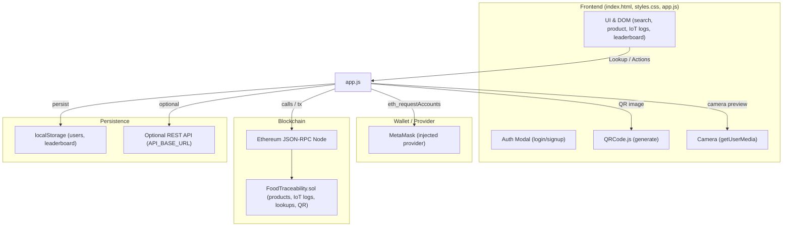

# Rich Products — Frozen Food Traceability (DApp)

A lightweight demo DApp that showcases farm-to-fork traceability for frozen food items. It supports both on-chain (MetaMask + Solidity contract) and offline demo modes.

## Overview
- Frontend: HTML, CSS, JavaScript (no build step)
- Web3: web3.js via CDN, MetaMask for wallet/transactions
- QR: QRCode.js (generation), jsQR (optional decoding)
- Demo mode: local in-browser data and persistence
- Smart contract: FoodTraceability.sol (product + IoT logs, lookups)

## Features
- Lookup product by lot (e.g., LOT-1001)
- Generate QR code and preview camera
- Simulate IoT temperature logs
- Consumer scan → session points and badges
- Leaderboard and badges (local persistence)
- Works without a blockchain (demo mode), or with a deployed contract

## Architecture (at a glance)

## Files
- index.html — UI layout and script/style includes
- styles.css — Design, layout, and animations
- app.js — App logic (UI handlers, Web3, demo persistence, QR)
- FoodTraceability.sol — Solidity smart contract
- TECHNICAL_ARCHITECTURE.txt — Detailed architecture notes

## Prerequisites
- A modern browser (Chrome/Brave/Edge) with MetaMask for on-chain mode
- A simple web server to serve static files (see Run section)
- Optional: Remix IDE (in-browser) to deploy the smart contract

## Run locally (Windows)
Pick one option:

Option A — Python (fastest)
- Open PowerShell in the project folder:
  - cd d:\SemV\BlockChain\capstone-blockchain
  - python -m http.server 8080
- Visit http://localhost:8080

Option B — VS Code Live Server
- Open the folder in VS Code
- Install “Live Server” extension
- Click “Go Live” and open the served URL

Option C — Node http-server
- If npx fails with PowerShell execution policy, use npx.cmd:
  - npx.cmd http-server -p 8080
- Or fix policy (current user):
  - Set-ExecutionPolicy RemoteSigned -Scope CurrentUser
- Then open http://localhost:8080

## Deploy the smart contract (Remix, quick path)
1) Open https://remix.ethereum.org
2) Create FoodTraceability.sol and paste the contract
3) Compile (Solidity 0.8.x)
4) Deploy using “Injected Provider — MetaMask” on your target network
5) Copy the deployed contract address

## Configure the frontend
1) Open app.js
2) Set your contract address:
   - const CONTRACT_ADDRESS = "0xYourDeployedAddress";
3) Optional: set a REST base URL (if you have one):
   - const API_BASE_URL = "https://your-api.example.com";
4) Save and refresh the page

Notes:
- If CONTRACT_ADDRESS is empty or unreachable, the app runs in demo mode.
- If API_BASE_URL is empty/unreachable, the app uses localStorage.

## Usage
- Connect Wallet: Click “Connect Wallet” (MetaMask prompt)
- Find Product: Enter a lot (e.g., LOT-1001) → Lookup
- Generate QR: Click “Generate QR” to render a QR image
- Scan (camera): Click “Scan (camera)” and allow camera permission (optional decoding if enabled)
- Simulate IoT Log: Adds a temperature record (on-chain tx or demo mode)
- Consumer Scan: Awards session points, may add badges; leaderboard updates in the sidebar
- Auth: Sign up / Login via modal (demo uses localStorage)

## Troubleshooting
- MetaMask not detected:
  - Use a browser with MetaMask installed and unlocked
- npx blocked in PowerShell:
  - Use npx.cmd http-server -p 8080
  - Or Set-ExecutionPolicy RemoteSigned -Scope CurrentUser
- Camera not working:
  - Allow camera permission in the browser (localhost is permitted)
- On-chain calls failing:
  - Ensure MetaMask is on the same network as your deployment
  - Verify CONTRACT_ADDRESS in app.js

## Testing (manual)
- Frontend: verify all buttons, modals, and flows in the browser
- Smart contract: use Remix to call functions and inspect storage
- Suggested (not included): Hardhat unit tests for contract logic

## Security notes
- Demo auth stores credentials in localStorage (plaintext). For production, replace with a secure backend (hashed passwords, tokens).
- On-chain logging is public and costs gas—use off-chain storage for heavy telemetry and store hashes/references on-chain.
- Randomness for QR tokens in demo contracts is not cryptographically secure.

## License
Educational/demo use. Review and adapt before production deployment.